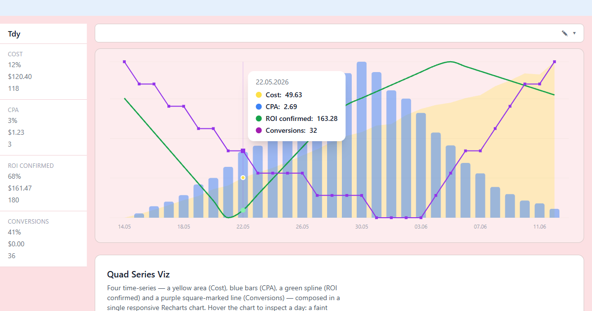

# Quad Series Viz 📊

A beautifully crafted, highly customizable React chart component that visualizes 4 distinct time-series data sequences in a single, cohesive interface. Built with a specific pastel "vibe" aesthetic, combining Area, Spline, Line, and Bar charts.

 
*(Replace with actual screenshot)*

## ✨ Features

- **4-in-1 Composed Chart:** Seamlessly blend Area, Spline, Line, and Bar charts.
- **Custom Tooltip:** A sleek, rounded tooltip that displays date and metrics with color-coded indicators.
- **Pastel Aesthetic:** Soft pink background, yellow area fill, green spline, purple line, and blue bars.
- **Fully Responsive:** Adapts to any container size using Recharts' `ResponsiveContainer`.
- **TypeScript First:** Strict typing for data sequences and component props.

## 🛠 Tech Stack

- **Framework:** React 19 (Vite 8)
- **Language:** TypeScript (strict)
- **Charting:** Recharts 3
- **Styling:** Tailwind CSS 4
- **Icons:** Lucide React (optional, for UI elements)

## 🚀 Getting Started

### Prerequisites

Ensure you have Node.js (v20.19 or higher) installed.

### Installation

1. Clone the repository:
   ```bash
   git clone https://github.com/your-username/vibe-quad-chart.git
   cd vibe-quad-chart
   ```

2. Install dependencies:
   ```bash
   npm install
   ```

3. Start the development server:
   ```bash
   npm run dev
   ```

## 📖 Usage

Import the `QuadChart` component and pass your time-series data. Each dataset must be an array of objects containing a `date` (string) and a `value` (number).

```tsx
import React from 'react';
import { QuadChart } from './components/QuadChart';

const areaData = [{ date: '12.06', value: 44.36 }, /* ... */];
const splineData = [{ date: '12.06', value: 161.47 }, /* ... */];
const lineData = [{ date: '12.06', value: 36 }, /* ... */];
const barData = [{ date: '12.06', value: 1.23 }, /* ... */];

export default function App() {
  return (
    <div className="w-full h-screen bg-pink-50 p-8">
      <QuadChart 
        areaData={areaData}
        splineData={splineData}
        lineData={lineData}
        barData={barData}
      />
    </div>
  );
}
```

### Props

| Prop | Type | Description |
|------|------|-------------|
| `areaData` | `{ date: string, value: number }[]` | Data for the yellow Area chart (Cost). |
| `splineData`| `{ date: string, value: number }[]` | Data for the green Spline chart (ROI confirmed). |
| `lineData` | `{ date: string, value: number }[]` | Data for the purple Line chart with square markers (Conversions). |
| `barData` | `{ date: string, value: number }[]` | Data for the blue Bar chart (CPA). |
| `height` | `number \| string` | Height of the chart box. Defaults to `100%`, so the parent sizes it. |
| `className` | `string` | Extra classes for the chart wrapper. |
| `showYAxis` | `boolean` | Renders the shared (normalized) Y axis. Hidden by default. |

### How four different scales share one axis

The metrics have incompatible magnitudes (Cost 30–120, CPA 0.5–5, ROI 161–186,
Conversions 30–36), so each series is rescaled into one shared domain anchored to
the ROI range (`ROI_SPAN` in `src/types/chart.types.ts`). Every curve keeps its
own shape and full height, matching the reference design, while **the tooltip
always reports the original values** for the hovered date.

## 🧪 Tests & Scripts

```bash
npm run dev      # Vite dev server
npm run build    # tsc -b && vite build (zero TS errors)
npm test         # node:test suite for the merge/normalize helpers
```

## 📂 Project Structure

```text
src/
├── components/
│   ├── QuadChart.tsx       # Main chart component
│   └── CustomTooltip.tsx   # Custom tooltip UI
├── types/
│   └── chart.types.ts      # Types, palette, merge/normalize helpers
├── data/
│   └── mockData.ts         # Deterministic 30-day demo data
├── tests/                  # (repository root) node:test suite for the helpers
├── App.tsx                 # Demo page (dashboard shell)
├── main.tsx                # React entry point
└── index.css               # Tailwind imports
```

## 📝 License

This project is licensed under the MIT License.
